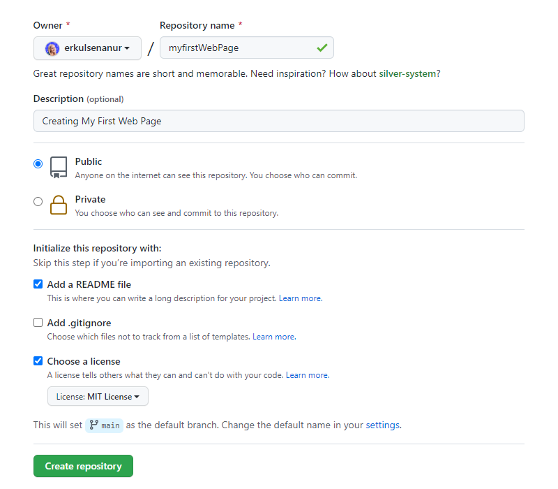

# My First Web Page
This repository is my first Web Page study.

## Installation
Firstly, clone the project.
```
git clone https://github.com/erkulsenanur/myfirstWebPage.git
```

## Usage
After clone the project, open with Visual Studio Code.

for Linux:
```
cd myfirstWebPage
code .
```

## Contributing
Pull requests are accepted. For major changes, please open a thread to discuss what you want to change.

## License
[MIT](https://choosealicense.com/licenses/mit/)